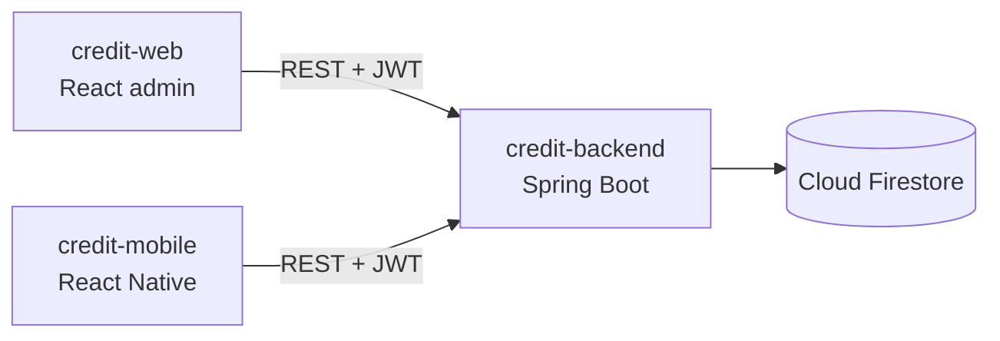
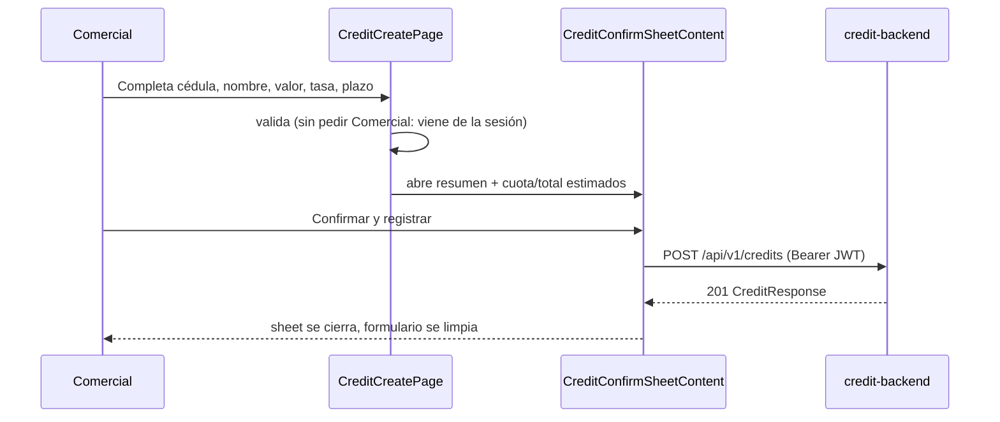

# Credit Mobile

React Native Android client for the Fya Social Capital credit technical test — the field-operative counterpart to `credit-web`.

## Sobre esta prueba técnica

Este repo es **uno de los tres entregables independientes** de la prueba técnica de créditos:

| Repo | Rol | README |
|---|---|---|
| `credit-backend` | API REST, Firestore, JWT, worker de correo | [`../credit-backend/README.md`](../credit-backend/README.md) |
| `credit-web` | Panel administrativo (React) para registrar/consultar créditos y monitorear correos | [`../credit-web/README.md`](../credit-web/README.md) |
| `credit-mobile` (este repo) | App Android (React Native) para el comercial en campo | — |

## Architecture



### Registrar crédito (con confirmación)



## Stack

| Layer | Tech |
|---|---|
| Runtime | React Native 0.83.0, React 19.2.0, TypeScript |
| Navigation | React Navigation 7 |
| Styling | NativeWind — layout from `challenge-blossom`, brand tokens from Fya Social Capital (`brand-*`/`ink`, shared with `credit-web`) |
| HTTP | Axios |
| Icons | lucide-react-native |
| Session | react-native-keychain |

## Feature-Sliced Structure

| Layer | Purpose | Doc |
|---|---|---|
| `src/app` | Providers and navigation | [`src/app/README.md`](src/app/README.md) |
| `src/pages` | `login`, `register`, `home`, `credit-create`, `credit-list` | [`src/pages/README.md`](src/pages/README.md) |
| `src/features` | `auth` and `credits` APIs | [`src/features/README.md`](src/features/README.md) |
| `src/entities` | Session and credit rules/formatting/payment estimate | [`src/entities/README.md`](src/entities/README.md) |
| `src/shared` | API client, config, storage, UI kit | [`src/shared/README.md`](src/shared/README.md) |

## Requisitos Previos

| Herramienta | Versión | Notas |
|---|---|---|
| Node.js | 20+ | Ver `engines` en `package.json` |
| JDK | 17 | Para Gradle/Android |
| Android Studio o SDK CLI | — | Necesitás un emulador (AVD) o un dispositivo con depuración USB |
| `credit-backend` corriendo | — | El emulador apunta a `http://10.0.2.2:8080` por defecto |

## Instalación Paso A Paso

1. **Asegurate de tener `credit-backend` corriendo** (ver su README).
2. **Instalá dependencias:**
   ```bash
   cd credit-mobile
   npm install
   ```
3. **Levantá un emulador Android** (Android Studio → Device Manager, o `emulator -avd <nombre>`).
4. **Corré la app:**
   ```bash
   npm run android
   ```
   El emulador ya apunta a `http://10.0.2.2:8080` (equivalente a `localhost:8080` de tu máquina) sin configuración adicional.
5. **Iniciá sesión** con un usuario sembrado del backend (`900100001 / demo12345`) o el usuario demo (`demo / demo12345`).

Para un dispositivo físico o un build de release, seguí la sección [Build APK](#build-apk) con `CREDIT_API_BASE_URL` apuntando a un backend accesible por HTTPS.

## Configure Backend URL

For local Android emulator the default is:

```text
http://10.0.2.2:8080
```

For release builds, set `CREDIT_API_BASE_URL` before running the build command:

```bash
CREDIT_API_BASE_URL=https://your-render-backend.example.com npm run build:apk
CREDIT_API_BASE_URL=https://your-render-backend.example.com npm run build:aab
```

The npm lifecycle writes `src/shared/config/generated.env.ts` before Android build/start commands — it's generated and gitignored; change `CREDIT_API_BASE_URL`, not that file.

> **APK/AAB builds are only run when explicitly requested** (see `AGENTS.md`) — they're slow and unnecessary for most JS/TS changes.

## Features

- Login with `{ username, password }` + JWT (username is the cédula or the demo user).
- Register account with numeric document and password.
- Token storage in Keychain.
- Register credit with a confirmation step (estimated monthly installment/total) before submitting.
- Query active credits: filter by client, document, salesperson; sort by date or amount.
- Session-expired handling.

## Build APK

```bash
npm run build:apk
```
Output: `android/app/build/outputs/apk/release/app-release.apk`

## Build AAB

```bash
npm run build:aab
```
Output: `android/app/build/outputs/bundle/release/app-release.aab`

## Signing

Production signing uses:

| Variable | Purpose |
|---|---|
| `ANDROID_KEYSTORE_BASE64` | Base64-encoded keystore (CI only) |
| `ANDROID_KEYSTORE_PASSWORD` | Keystore password |
| `ANDROID_KEY_ALIAS` | Signing key alias |
| `ANDROID_KEY_PASSWORD` | Signing key password |

The CI workflow writes `release.keystore` only during CI runs. Local builds fall back to a debug-only keystore so an installable APK can be generated without production secrets. Gradle consumes `RELEASE_STORE_FILE`, `RELEASE_STORE_PASSWORD`, `RELEASE_KEY_ALIAS`, `RELEASE_KEY_PASSWORD`.

## Quality

```bash
npm run typecheck
npm run lint
npm test
```

## Documentation Map

| File | Covers |
|---|---|
| [`AGENTS.md`](AGENTS.md) | Working rules for agents (the only `AGENTS.md` in this repo — includes the full doc map) |
| `src/**/README.md` | Per layer/slice: purpose, key files, risks |
| [`docs/permissions-rules.md`](docs/permissions-rules.md) | Android permissions |
| [`knowledge/auth/current-auth-session-flow.md`](knowledge/auth/current-auth-session-flow.md) | JWT session flow |
| [`knowledge/credits/current-credit-registration-flow.md`](knowledge/credits/current-credit-registration-flow.md) | Credit registration + confirmation |
| [`knowledge/credits/current-credit-query-flow.md`](knowledge/credits/current-credit-query-flow.md) | Credit query/filters |
| [`knowledge/android/current-android-build-and-signing-flow.md`](knowledge/android/current-android-build-and-signing-flow.md) | Build and signing |
