# Credit Mobile

App Android (React Native) para la prueba técnica de créditos de Fya Social Capital — la contraparte para el comercial en campo de `credit-web`.

## Índice
- [Sobre esta prueba técnica](#sobre-esta-prueba-técnica)
- [Capturas](#capturas)
- [Arquitectura](#arquitectura)
- [Stack](#stack)
- [Estructura Feature-Sliced](#estructura-feature-sliced)
- [Requisitos Previos](#requisitos-previos)
- [Instalación Paso A Paso](#instalación-paso-a-paso)
- [Configurar La URL Del Backend](#configurar-la-url-del-backend)
- [Funcionalidades](#funcionalidades)
- [Offline](#offline)
- [Calidad](#calidad)
- [Compilar APK](#compilar-apk)
- [Compilar AAB](#compilar-aab)
- [CI (GitHub Actions)](#ci-github-actions)
- [Firma](#firma)
- [Mapa De Documentación](#mapa-de-documentación)

## Sobre esta prueba técnica

Este repo es **uno de los tres entregables independientes** de la prueba técnica de créditos:

| Repo | Rol | README |
|---|---|---|
| `credit-backend` | API REST, Firestore, JWT, worker de correo | [github.com/CarlosPolo019/credit-backend](https://github.com/CarlosPolo019/credit-backend) |
| `credit-web` | Panel administrativo (React) para registrar/consultar créditos y monitorear correos | [github.com/CarlosPolo019/credit-web](https://github.com/CarlosPolo019/credit-web) |
| `credit-mobile` (este repo) | App Android (React Native) para el comercial en campo | — |

## Capturas

| Login | Home (admin) |
|---|---|
| 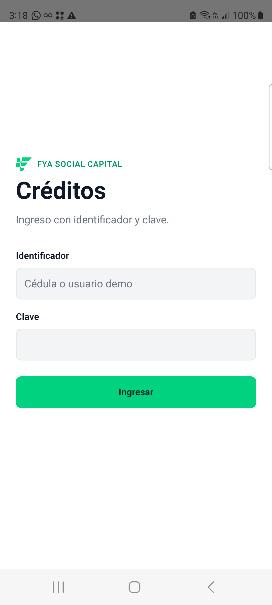 | 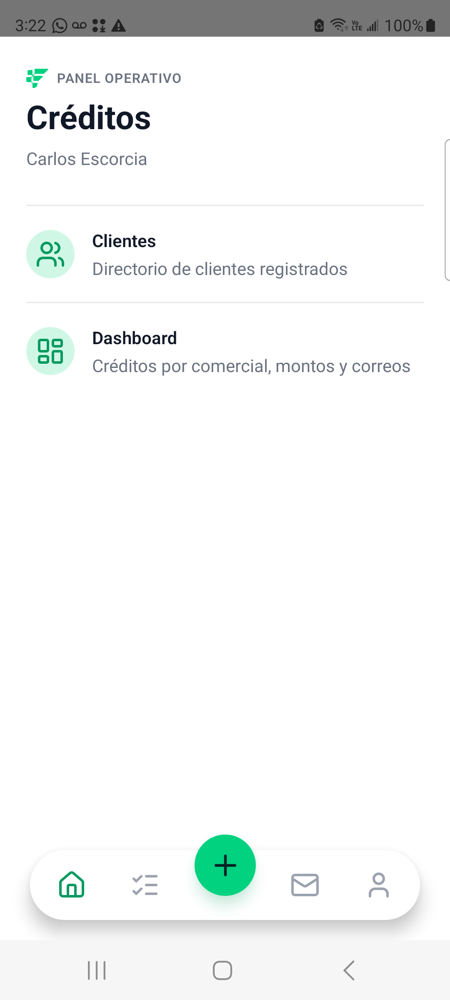 |

| Nav de 3 tabs (rol USER) | Registrar crédito |
|---|---|
| 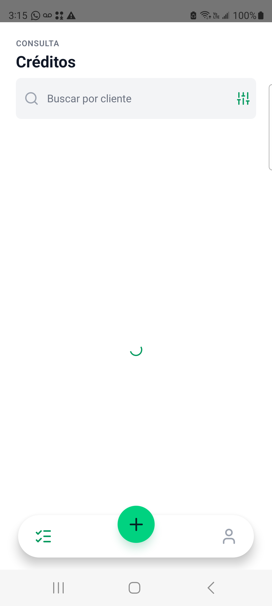 | 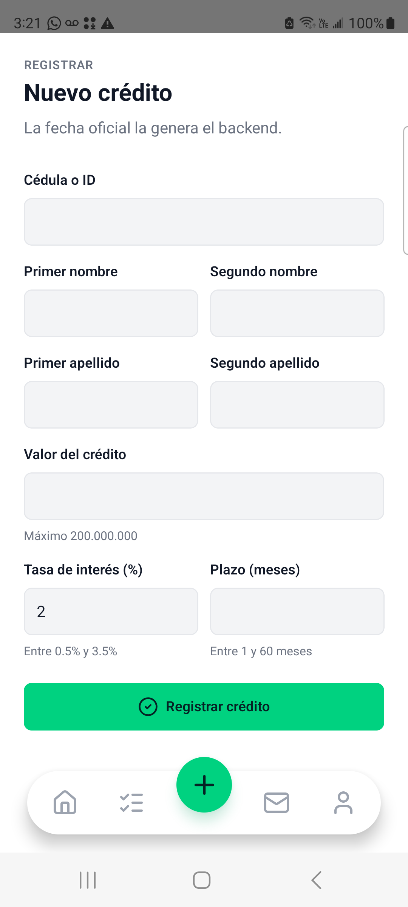 |

| Consultar créditos | Detalle de crédito |
|---|---|
| 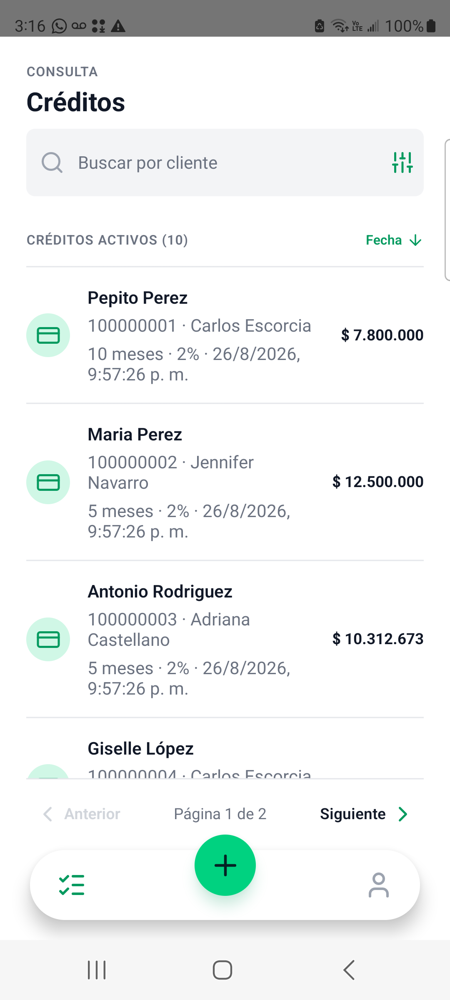 | 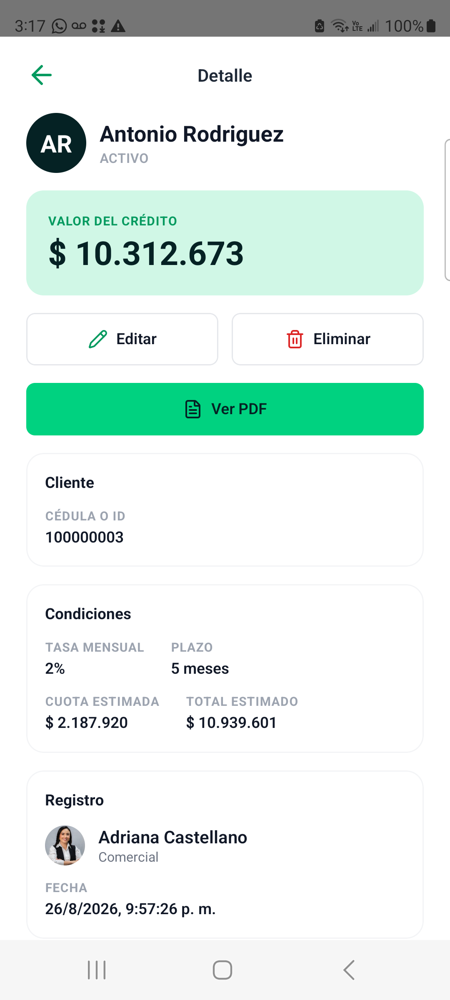 |

| Correos (admin) | Clientes (admin) |
|---|---|
| 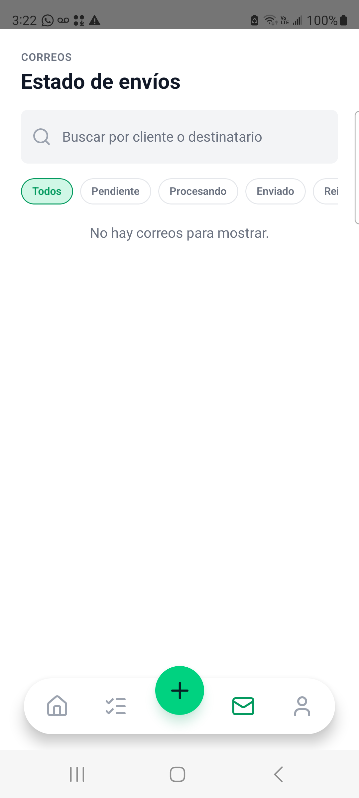 | 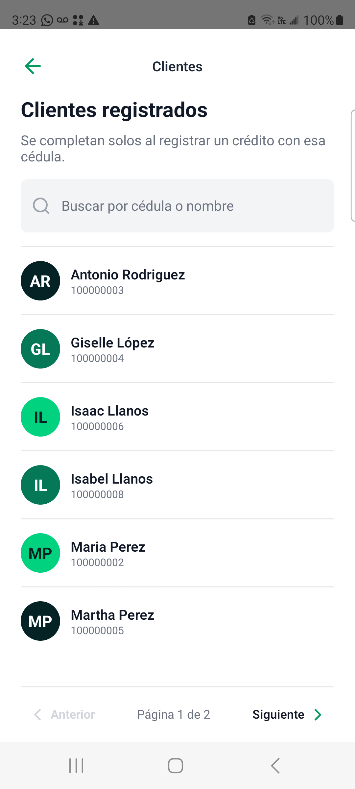 |

| Perfil | |
|---|---|
| 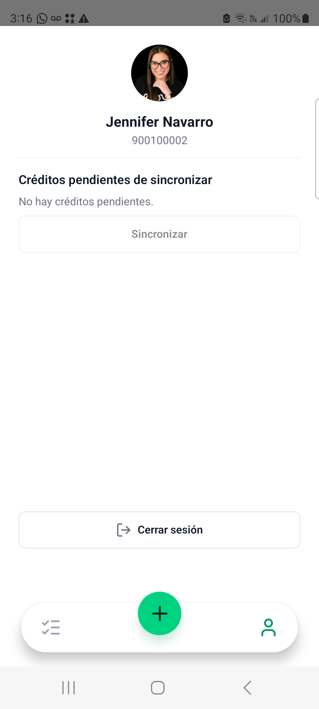 | |

## Arquitectura

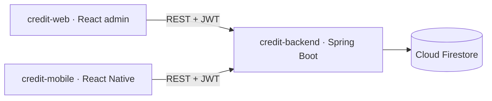

### Registrar crédito (con confirmación, online)

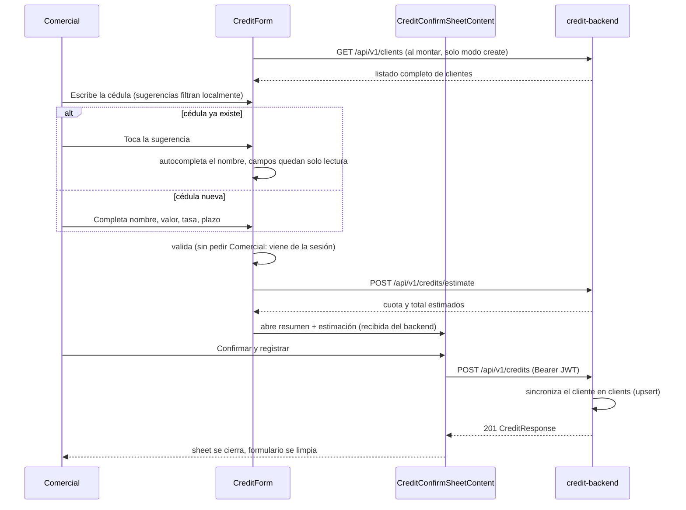

Sin internet, el registro sigue funcionando: se salta la estimación y el crédito se guarda en una cola local que se sincroniza sola al volver la conexión — ver [Offline](#offline).

## Stack

| Capa | Tecnología |
|---|---|
| Runtime | React Native 0.83.0, React 19.2.0, TypeScript |
| Navegación | React Navigation 7 (`@react-navigation/native-stack` + `@react-navigation/bottom-tabs`, tabBar 100% custom) |
| Estilos | NativeWind — layout inspirado en `challenge-blossom`, tokens de marca de Fya Social Capital (`brand-*`/`ink`, compartidos con `credit-web`) |
| HTTP | Axios |
| Iconos | lucide-react-native |
| Sesión | react-native-keychain |
| Ver PDF | Generado en `credit-backend` (`GET /credits/{id}/pdf`), se abre directo en el navegador del dispositivo (`Linking.openURL`) — la app no descarga ni renderiza el PDF |
| Offline | @react-native-community/netinfo (detección de conectividad) + @react-native-async-storage/async-storage (cola local de créditos) |

## Estructura Feature-Sliced

| Capa | Propósito | Doc |
|---|---|---|
| `src/app` | Providers, navegación (`MainTabs`/`AppRouter`) | [`src/app/README.md`](src/app/README.md) |
| `src/pages` | `login`, `home`, `profile`, `credit-create`, `credit-list`, `credit-detail`, `client-list`, `email-job-list`, `dashboard` | [`src/pages/README.md`](src/pages/README.md) |
| `src/features` | APIs de `auth`, `credits` y `email-jobs` | [`src/features/README.md`](src/features/README.md) |
| `src/entities` | Reglas de sesión y crédito, formato, estimación de pago | [`src/entities/README.md`](src/entities/README.md) |
| `src/shared` | Cliente API, config, storage, kit de UI | [`src/shared/README.md`](src/shared/README.md) |

## Requisitos Previos

| Herramienta | Versión | Notas |
|---|---|---|
| Node.js | 20+ | Ver `engines` en `package.json` |
| JDK | 17 | Para Gradle/Android |
| Android Studio o SDK CLI | — | Necesitás un emulador (AVD) o un dispositivo con depuración USB |
| `credit-backend` corriendo | — | El emulador apunta a `http://10.0.2.2:8080` por defecto |

## Instalación Paso A Paso

1. **Asegurate de tener `credit-backend` corriendo** (ver su README).
2. **Instalá dependencias:**
   ```bash
   cd credit-mobile
   npm install
   ```
3. **Levantá un emulador Android** (Android Studio → Device Manager, o `emulator -avd <nombre>`).
4. **Corré la app:**
   ```bash
   npm run android
   ```
   El emulador ya apunta a `http://10.0.2.2:8080` (equivalente a `localhost:8080` de tu máquina) sin configuración adicional.
5. **Iniciá sesión** con un usuario sembrado del backend (`900100001 / demo12345`) o el usuario demo (`demo / demo12345`).

Para un dispositivo físico o un build de release, seguí la sección [Compilar APK](#compilar-apk) con `CREDIT_API_BASE_URL` apuntando a un backend accesible por HTTPS.

## Configurar La URL Del Backend

Para el emulador Android local, el valor por defecto es:

```text
http://10.0.2.2:8080
```

Para un dispositivo físico conectado por USB, `npm run android:device` / `npm run start:device` ya traen la URL de producción (`https://fyatest-api.cmescorcia.com`) hardcodeada, para no tener que escribirla cada vez.

Para builds de release, seteá `CREDIT_API_BASE_URL` antes de correr el comando de build:

```bash
CREDIT_API_BASE_URL=https://fyatest-api.cmescorcia.com npm run build:apk
CREDIT_API_BASE_URL=https://fyatest-api.cmescorcia.com npm run build:aab
```

`https://fyatest-api.cmescorcia.com` es la API de producción — la misma que consume `credit-web`, servida por HTTPS bajo su propio subdominio. Un APK/AAB compilado con ese valor habla contra producción en vez de un backend local.

El lifecycle de npm escribe `src/shared/config/generated.env.ts` antes de los comandos de build/start de Android — es generado y está en `.gitignore`; cambiá `CREDIT_API_BASE_URL`, no ese archivo.

> **Los builds de APK/AAB solo se corren cuando se piden explícitamente** (ver `AGENTS.md`) — son lentos e innecesarios para la mayoría de los cambios JS/TS.

## Funcionalidades

- Login con `{ username, password }` + JWT (`username` puede ser la cédula o el usuario demo), token guardado en Keychain.
- Navegación por pestañas flotantes (bottom tabs, `src/app/MainTabs.tsx` + `FloatingTabBar.tsx`, tabBar 100% custom, no la barra nativa): `ADMIN` ve 5 tabs (Home, Créditos, **Registrar** — botón central elevado, destacado sobre los demás —, Correos, Perfil); un `USER` normal ve solo 3 (Créditos, Registrar, Perfil), sin Home (que solo tenía accesos de admin) ni Correos.
- Registrar crédito con un paso de confirmación (cuota mensual/total estimados) antes de enviar; límites de monto ($200.000.000 máx.), tasa (0.5%–3.5% mensual) y plazo (1–60 meses) validados en el formulario, con el mismo criterio que `credit-web` y el backend.
- Consultar créditos activos: filtrar por cliente, documento, comercial (select); ordenar por fecha o monto; paginado (6 por página).
- Cédula con autocomplete al registrar: si ya existe, el nombre se completa solo y queda de solo lectura.
- Detalle de crédito: ver, editar, eliminar, historial de auditoría (quién cambió qué) y ver el PDF del crédito (generado en el servidor, se abre directo en el navegador del dispositivo).
- Pantalla de "despertando el servidor": antes de Login, si el backend (Render free tier) está dormido, la app hace polling a `/actuator/health` con mensajes de espera en vez de mostrar un error de conexión confuso. Con sesión ya iniciada no bloquea nada — ver [Offline](#offline).
- Sin auto-registro: las cuentas se crean solo desde `credit-web` (`/users`, admin-only) — no hay pantalla de registro público en la app.
- Clientes y Dashboard: solo para `role: "ADMIN"` (hoy, Carlos Escorcia) — accesos extra en el tab Home (no tienen tab propio). Clientes paginado (6 por página); el dato es el mismo que usa el autocomplete, sin restricción de rol en el backend, solo la pantalla es de admin.
- Correos: solo para `role: "ADMIN"` — a diferencia de Clientes/Dashboard, sí tiene su propio tab (el 5to). El backend también lo exige (403 para cualquier otra cuenta). Paginado (6 por página).
- Dashboard: resumen de créditos por comercial, monto total solicitado, ganancia estimada, tasa de interés promedio y correos por estado, calculado en el cliente a partir de los mismos datos de Créditos y Correos (sin endpoint propio) — equivalente móvil del Dashboard de `credit-web`.
- Modo oscuro: toda la UI (NativeWind `dark:` variants) sigue el tema del sistema operativo automáticamente, sin selector manual — colores de marca, tarjetas, texto y el tab bar flotante tienen su contraparte oscura.
- Splash screen animado con marca e ícono de la app.
- Manejo de sesión expirada.

## Offline

El comercial en campo no siempre tiene señal — registrar un crédito es la única operación pensada para funcionar sin internet, con sincronización automática al recuperar la conexión. El resto de la app (consultar, editar, eliminar, ver PDF, login) requiere conexión, con un mensaje claro en vez de un error genérico cuando falta.

- **Detección de conectividad**: `shared/network/NetworkStatusContext.tsx` (`@react-native-community/netinfo`) expone `isOnline` de forma global; un `OfflineBanner` visible en todas las pantallas avisa cuando no hay señal.
- **Registrar sin conexión**: `CreditForm` salta el paso de estimar la cuota (requiere backend) y guarda el crédito en una cola local (`AsyncStorage`, `features/credits/offlineQueue.ts`) en vez de llamar a la API — el operador ve confirmación inmediata ("Crédito guardado offline. Se sincronizará cuando vuelva internet.").
- **Sincronización automática**: al recuperar la conexión, `AutoSyncOnReconnect` (montado en `src/app/AppRouter.tsx`, corre sin importar qué pestaña esté abierta) dispara `syncQueuedCredits()`, que reintenta cada item de la cola contra `POST /api/v1/credits`. Los que fallan quedan marcados `failed` y se reintentan en la próxima sincronización.
- **Sincronización manual**: desde el tab **Perfil**, un contador de créditos pendientes/fallidos y un botón "Sincronizar" (solo visible con internet).
- **Cold start del backend**: como el backend gratuito (Render) se duerme tras inactividad, `BackendWakeGate` hace polling a `/actuator/health` con una pantalla animada de espera antes de dejar entrar al login — pero solo bloquea el flujo **sin sesión**; con sesión ya iniciada la app nunca espera al backend, justamente para que la cola offline sirva de algo aunque el servidor esté dormido.
- Detalle completo, diagrama de secuencia y casos borde: [`knowledge/credits/current-credit-offline-queue-flow.md`](knowledge/credits/current-credit-offline-queue-flow.md).

## Calidad

```bash
npm run typecheck
npm run lint
npm test
```

## Compilar APK

```bash
npm run build:apk
```
Salida: `android/app/build/outputs/apk/release/app-release.apk`

## Compilar AAB

```bash
npm run build:aab
```
Salida: `android/app/build/outputs/bundle/release/app-release.aab`

## CI (GitHub Actions)

`.github/workflows/build-android.yml` compila el APK y el AAB de release. Es `workflow_dispatch` solamente (disparo manual desde la pestaña Actions) — no hay build automático en push ni en tag, siguiendo la política de "solo se compila cuando se pide explícitamente" de arriba. Corre `npm run build:apk` y `npm run build:aab` con los secrets de firma de abajo y sube ambos artefactos.

## Firma

La firma de producción usa:

| Variable | Propósito |
|---|---|
| `ANDROID_KEYSTORE_BASE64` | Keystore en Base64 (solo CI) |
| `ANDROID_KEYSTORE_PASSWORD` | Contraseña del keystore |
| `ANDROID_KEY_ALIAS` | Alias de la key de firma |
| `ANDROID_KEY_PASSWORD` | Contraseña de la key de firma |

El workflow de CI escribe `release.keystore` solo durante los runs de CI. Los builds locales caen a un keystore de debug para poder generar un APK instalable sin secrets de producción. Gradle consume `RELEASE_STORE_FILE`, `RELEASE_STORE_PASSWORD`, `RELEASE_KEY_ALIAS`, `RELEASE_KEY_PASSWORD`.

## Mapa De Documentación

| Archivo | Qué cubre |
|---|---|
| [`AGENTS.md`](AGENTS.md) | Reglas de trabajo para agentes (el único `AGENTS.md` de este repo — incluye el mapa de documentación completo) |
| `src/**/README.md` | Por capa/slice: propósito, archivos clave, riesgos |
| [`docs/permissions-rules.md`](docs/permissions-rules.md) | Permisos de Android |
| [`knowledge/auth/current-auth-session-flow.md`](knowledge/auth/current-auth-session-flow.md) | Flujo de sesión JWT |
| [`knowledge/credits/current-credit-registration-flow.md`](knowledge/credits/current-credit-registration-flow.md) | Registro de crédito + confirmación |
| [`knowledge/credits/current-credit-query-flow.md`](knowledge/credits/current-credit-query-flow.md) | Consulta/filtros de créditos |
| [`knowledge/credits/current-credit-detail-flow.md`](knowledge/credits/current-credit-detail-flow.md) | Detalle de crédito: ver, editar, eliminar, historial de auditoría, ver PDF |
| [`knowledge/credits/current-credit-offline-queue-flow.md`](knowledge/credits/current-credit-offline-queue-flow.md) | Creación de créditos offline, cola local, sincronización |
| [`knowledge/android/current-android-build-and-signing-flow.md`](knowledge/android/current-android-build-and-signing-flow.md) | Build y firma |
