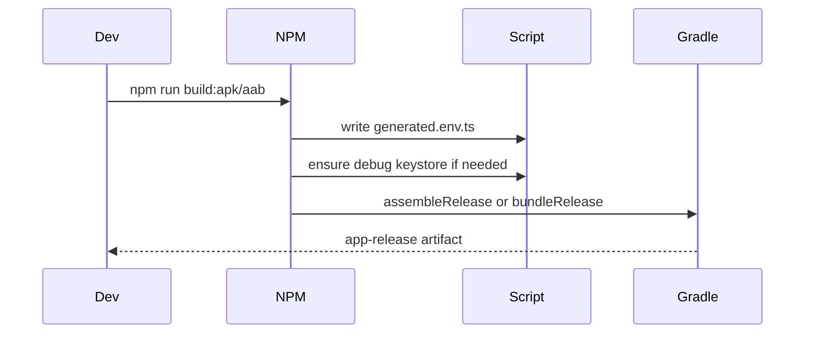

# Flow: Android Build And Signing

## Estado
- `active`

## Proposito
- Generar APK/AAB release configurables sin versionar secretos.
- Este flujo solo se ejecuta cuando el usuario pide explicitamente compilar Android.

## Participantes
- `package.json`
- `scripts/write-mobile-config.js`
- `scripts/ensure-android-debug-keystore.js`
- `android/app/build.gradle`
- `.github/workflows/build-android.yml`

## Flujo

## Politica De Ejecucion
- No ejecutar `npm run build:apk` ni `npm run build:aab` por cambios de UI TypeScript, contrato REST, docs, estilos NativeWind o validaciones locales.
- Usar `npm run typecheck`, `npm run lint` y `npm test` como validacion normal cuando el cambio no toca Android nativo.
- Pedir orden explicita antes de compilar si cambiaron Gradle, AndroidManifest, permisos, package nativo, signing, assets nativos, autolinking o versionado release.

## Configuracion
- Local emulator default: `http://10.0.2.2:8080`.
- Release: usar `CREDIT_API_BASE_URL=https://...`.
- CI secrets: `ANDROID_KEYSTORE_BASE64`, `ANDROID_KEYSTORE_PASSWORD`, `ANDROID_KEY_ALIAS`, `ANDROID_KEY_PASSWORD`.
- Gradle env: `RELEASE_STORE_FILE`, `RELEASE_STORE_PASSWORD`, `RELEASE_KEY_ALIAS`, `RELEASE_KEY_PASSWORD`.
- `.github/workflows/build-android.yml` es `workflow_dispatch`-only: se dispara a mano desde la pestana Actions, nunca por push/tag automatico.

## Errores
- Si no hay secrets de release, Gradle cae a debug keystore generado localmente.
- `generated.env.ts` y `debug.keystore` no se versionan.

## Gotchas Conocidos (Release APK)
- `MainApplication.java` debe inicializar `SoLoader.init(this, OpenSourceMergedSoMapping.INSTANCE)` (no `SoLoader.init(this, false)`): con New Architecture + libs `.so` merged, omitir el mapping causa un crash al arrancar en dispositivos fisicos (no se ve en Metro/debug).
- `values/styles.xml` (`AppTheme`) debe heredar de `Theme.AppCompat.Light.NoActionBar` (no un tema de plataforma plano): un tema sin AppCompat tambien crashea el release APK al arrancar en dispositivo fisico. Ambos fixes son necesarios juntos; antes de ellos el release APK crasheaba en todo dispositivo fisico (funcionaba en debug/emulador).

## Validacion
- `npm run build:apk` solo con orden explicita del usuario.
- `npm run build:aab` solo con orden explicita del usuario.
