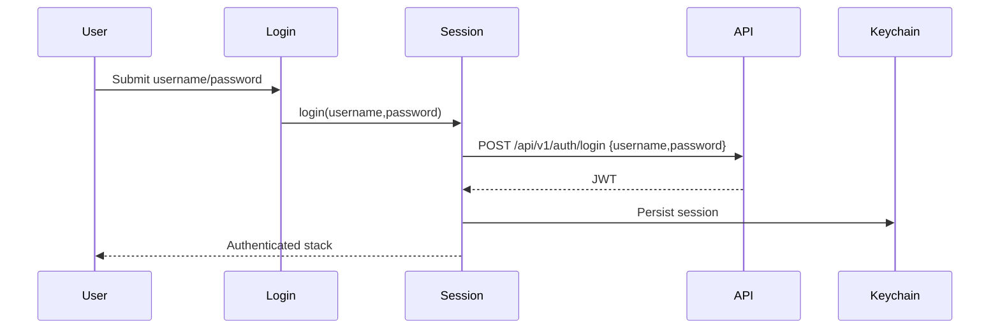

# Flow: Auth Session

## Estado
- `active`

## Proposito
- Autenticar por `username` del backend y conservar la sesion JWT en Keychain.

## Participantes
- `pages/login/LoginPage.tsx`
- `features/auth/api.ts`
- `entities/session/SessionContext.tsx`
- `shared/lib/storage/sessionStorage.ts`
- `shared/api/client.ts`

## Flujo

Login usa el campo backend `username`. Para usuarios registrados ese valor es la cedula normalizada; para compatibilidad tambien puede ser el usuario demo configurado por ambiente.

Sin auto-registro en mobile: las cuentas se crean solo desde `credit-web` (`/users`, admin-only, `POST /api/v1/users`). El backend ya ni siquiera expone `POST /api/v1/auth/register` — se elimino del todo (controller, service y DTO) porque nadie lo llamaba: `pages/register/RegisterPage.tsx` existio en mobile en una version anterior y se elimino primero, para mantener la creacion de cuentas centralizada en el administrador; una vez confirmado que ningun cliente lo usaba, el endpoint publico tambien se elimino del backend.

## Errores
- Credenciales invalidas: mostrar banner y no guardar sesion.
- `401` posterior: interceptor llama logout y limpia Keychain.
- Storage corrupto: se limpia y vuelve a estado publico.

## Validacion
- `npm test`
- Prueba manual: login con una cedula existente o el usuario demo, cerrar app, abrir app y verificar restauracion de sesion; luego logout/login de nuevo.
