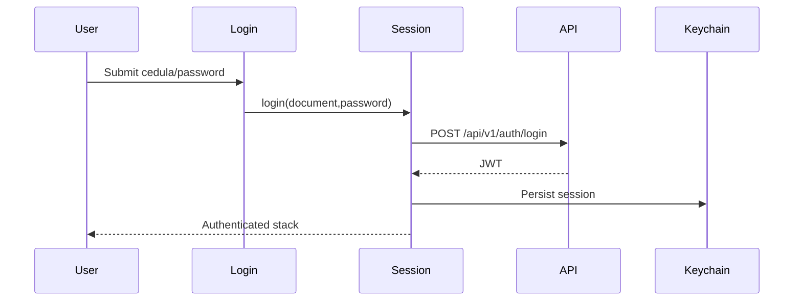

# Flow: Auth Session

## Estado
- `active`

## Proposito
- Registrar o autenticar por cedula y conservar la sesion JWT en Keychain.

## Participantes
- `pages/login/LoginPage.tsx`
- `pages/register/RegisterPage.tsx`
- `features/auth/api.ts`
- `entities/session/SessionContext.tsx`
- `shared/lib/storage/sessionStorage.ts`
- `shared/api/client.ts`

## Flujo

Registro usa `POST /api/v1/auth/register` con `fullName`, `document` y `password`, y persiste la misma respuesta de sesion.

## Errores
- Credenciales invalidas: mostrar banner y no guardar sesion.
- `401` posterior: interceptor llama logout y limpia Keychain.
- Storage corrupto: se limpia y vuelve a estado publico.

## Validacion
- `npm test`
- Prueba manual: registrar cedula, cerrar app, abrir app y verificar restauracion; luego logout/login con la misma cedula.
