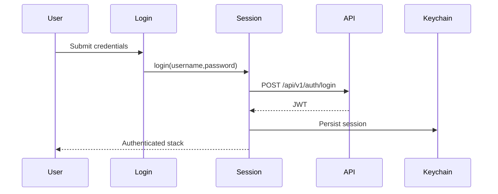

# Flow: Auth Session

## Estado
- `active`

## Proposito
- Autenticar al usuario demo y conservar la sesion JWT en Keychain.

## Participantes
- `pages/login/LoginPage.jsx`
- `features/auth/api.js`
- `entities/session/SessionContext.jsx`
- `shared/lib/storage/sessionStorage.js`
- `shared/api/client.js`

## Flujo

## Errores
- Credenciales invalidas: mostrar banner y no guardar sesion.
- `401` posterior: interceptor llama logout y limpia Keychain.
- Storage corrupto: se limpia y vuelve a estado publico.

## Validacion
- `npm test`
- Prueba manual: login, cerrar app, abrir app y verificar restauracion.

