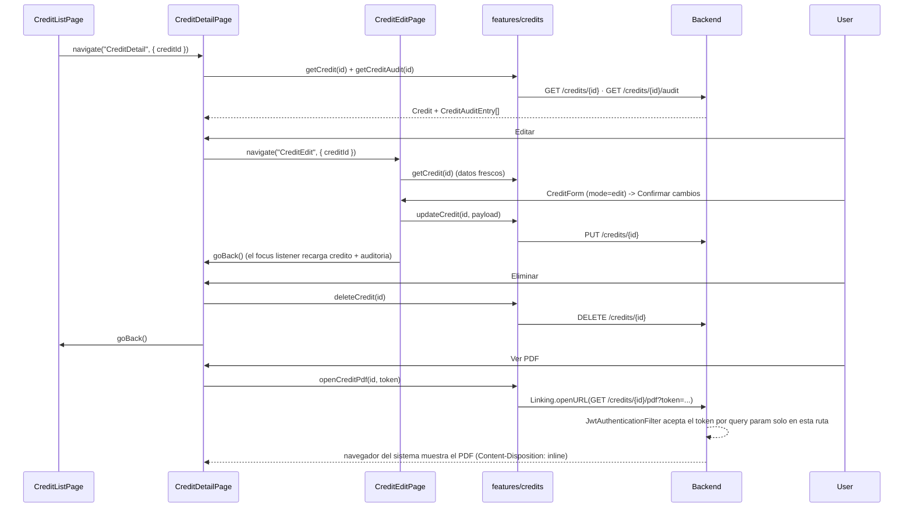

# Flow: Credit Detail (Ver, Editar, Eliminar, Auditoria, PDF)

## Estado
- `active`

## Proposito
- Ver el detalle completo de un credito, editarlo, eliminarlo, verlo en PDF y ver quien lo cambio.

## Participantes
- `pages/credit-list/CreditListPage.tsx` (la fila navega a `CreditDetail`)
- `pages/credit-detail/CreditDetailPage.tsx`
- `pages/credit-detail/CreditEditPage.tsx`
- `pages/credit-create/CreditForm.tsx` (compartido entre crear y editar, `mode` prop)
- `pages/credit-detail/DeleteCreditSheetContent.tsx`
- `pages/credit-detail/CreditAuditHistory.tsx`
- `features/credits/api.ts`
- `features/credits/pdf.ts`
- `entities/session/SessionContext.tsx` (token para la descarga del PDF)

## Flujo

## Decisiones
- El PDF se genera en el backend (OpenPDF), no en el dispositivo: evita una libreria nativa de render de PDF. `pdf.ts` no descarga nada al dispositivo: arma la URL (con el token como query param, porque un tab de navegador no puede mandar el header `Authorization`) y la abre con `Linking.openURL`. Content-Disposition es `inline`, asi el navegador lo renderiza en vez de forzar la descarga.
- Se reemplazo el flujo anterior de descargar+compartir (`react-native-blob-util` + `react-native-share`) porque fallaba de forma intermitente en dispositivos reales ("Download Interrupted" segun la app elegida en el share sheet). Abrir la URL en el navegador es mas simple y evita esa capa entera.
- `CreditForm.tsx` es un solo componente para crear y editar (`mode` prop), igual que `credit-web/pages/credits/CreditForm.jsx` — evita mantener dos formularios casi identicos.
- El comercial nunca es editable, ni en el formulario ni en el backend (`PUT` lo ignora si viniera).
- El historial de auditoria se recarga automaticamente al volver de `CreditEdit` (listener de `focus` en `CreditDetailPage`), no solo al montar.
- No hay una columna de acciones tipo tabla en `CreditListPage` (no es idiomatico en una lista mobile): tocar la fila lleva al detalle, y editar/eliminar viven ahi.

## Errores
- Credito inexistente/inactivo: `ErrorMessage` de pagina completa con boton para volver.
- Fallo al eliminar o abrir el PDF: `Banner` de error en el detalle, no bloquea la pantalla.
- Sesion sin token al ver el PDF: `openCreditPdf` lanza antes de abrir el navegador.

## Validacion
- `npm run typecheck`
- `npm run lint`
- `npm test`
- Prueba manual en dispositivo: listar -> tocar un credito -> editar -> confirmar -> ver la entrada nueva en el historial -> ver PDF (se abre el navegador con el certificado) -> eliminar (confirmar) -> vuelve al listado.
