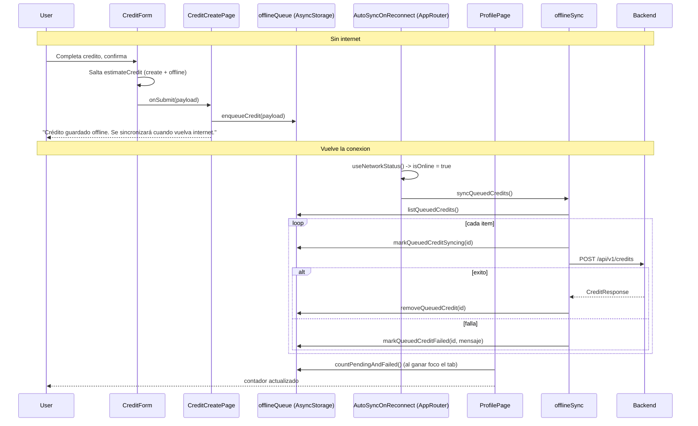

# Flow: Offline Credit Queue

## Estado
- `active`

## Proposito
- Permitir registrar creditos sin internet, guardandolos en una cola local y sincronizandolos al volver la conexion. Editar, eliminar, ver PDF y login siguen requiriendo internet (no hay pantalla de registro — ver `knowledge/auth/current-auth-session-flow.md`).

## Participantes
- `shared/network/NetworkStatusContext.tsx` (`NetworkStatusProvider`/`useNetworkStatus`, montado en `src/app/App.tsx`)
- `shared/ui/OfflineBanner.tsx` (renderizado en `src/app/AppRouter.tsx`, arriba de `Stack.Navigator`)
- `shared/api/client.ts` (traduce errores de red sin `response` a un mensaje offline)
- `pages/credit-create/CreditCreatePage.tsx`, `CreditForm.tsx`, `CreditConfirmSheetContent.tsx`
- `features/credits/offlineQueue.ts` (cola en `AsyncStorage`)
- `features/credits/offlineSync.ts` (`syncQueuedCredits`)
- `app/AppRouter.tsx` (`AutoSyncOnReconnect`, dispara la sincronizacion automatica — vive aca, no en una pantalla, para que corra sin importar que tab tenga abierto el usuario)
- `pages/profile/ProfilePage.tsx` (tab "Perfil": muestra el conteo pendiente/fallido y el boton "Sincronizar" manual — reemplazo al bottom sheet `ProfileSheetContent` que abria el avatar de `HomePage`)

## Flujo

## Deteccion de conectividad
- `NetworkStatusProvider` escucha `NetInfo.addEventListener` y expone `status: "online" | "limited" | "offline"`. `isOnline` es `false` solo en `"offline"` (sin `isConnected` o `isInternetReachable === false`); `"limited"` (todavia resolviendo) se trata como online para no bloquear creacion, pero el banner lo distingue visualmente.
- `OfflineBanner` se monta una sola vez en `AppRouter`, visible en todas las pantallas (autenticadas o no).

## Cola local
- `AsyncStorage`, key `fya-credit-offline-queue`, array de `{ id, payload, createdAt, attempts, status: "pending" | "syncing" | "failed", lastError }`.
- `id` es `${Date.now()}-${random}` (no UUID, suficiente para una cola local de un solo dispositivo).
- No hay idempotencia remota: si `removeQueuedCredit` fallara justo despues de un `createCredit` exitoso, un reintento manual duplicaria el credito en el backend. Riesgo aceptado en esta version (ver Assumptions del plan original).

## Sincronizacion
- Automatica: `AutoSyncOnReconnect` (`app/AppRouter.tsx`) corre `syncQueuedCredits()` cada vez que `isOnline` pasa a `true` — headless, no una pantalla, montado siempre que hay sesion (no depende de que tab este abierto).
- Manual: boton "Sincronizar" en `pages/profile/ProfilePage.tsx` (deshabilitado si no hay items pendientes/fallidos, oculto si no hay internet).
- Items `failed` se reintentan en la siguiente sincronizacion (automatica o manual) igual que los `pending`.
- Un credito sincronizado no aparece en `CreditList` hasta que la sincronizacion termina (no hay estado "optimista" en la lista).

## Alcance
- Solo creacion de creditos funciona offline. Editar (`CreditForm` en modo `edit`), eliminar, ver PDF y login siempre requieren internet — si fallan sin conexion, `shared/api/client.ts` devuelve "Sin conexión. Revisa internet e intenta de nuevo." y la pantalla lo muestra como cualquier otro error.
- No se toco el backend: `POST /api/v1/credits` es el mismo endpoint que usa la creacion online.
- `src/app/BackendWakeGate.tsx` (cold start de Render) solo envuelve el stack **no autenticado**: una sesion ya iniciada nunca queda bloqueada esperando al backend, precisamente para que la cola offline pueda usarse mientras el backend esta dormido/arrancando, no solo cuando el dispositivo esta sin señal. Login si espera, porque no tiene modo offline.

## Errores
- Sin conexion al llamar cualquier endpoint: `shared/api/client.ts` devuelve "Sin conexión. Revisa internet e intenta de nuevo." (en vez del mensaje generico).
- Fallo al sincronizar un item de la cola: queda `status: "failed"` con `lastError` saneado (el `Error.message` que ya paso por el interceptor de Axios); no bloquea la sincronizacion de los demas items.

## Validacion
- `npm run typecheck`
- `npm run lint`
- `npm test` (`__tests__/offlineQueue.test.ts`, `__tests__/apiClientOfflineError.test.ts`)
- Prueba manual Android: apagar internet, crear un credito, ver el banner y el conteo pendiente en el tab Perfil, reactivar internet, confirmar que se sincroniza solo y aparece en el listado/backend.
