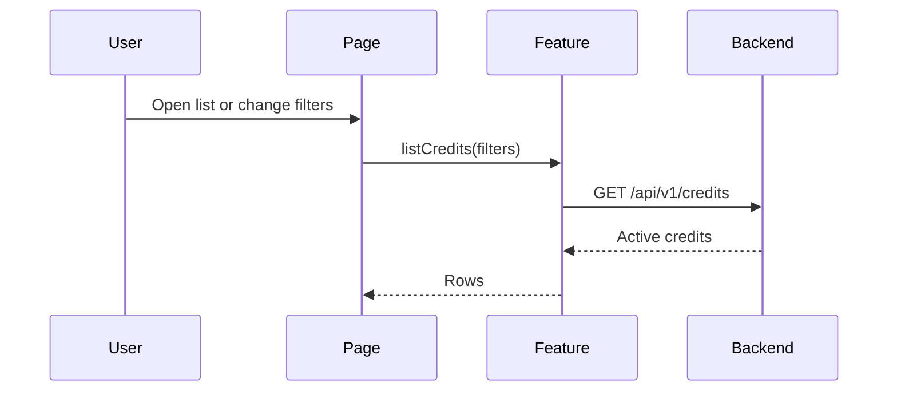

# Flow: Credit Query

## Estado
- `active`

## Proposito
- Consultar creditos activos con filtros y ordenamiento.

## Participantes
- `pages/credit-list/CreditListPage.jsx`
- `features/credits/api.js`
- `entities/credit/format.js`
- `entities/credit/validation.js`

## Flujo

## Errores
- Error de red: mostrar banner y conservar control de filtros.
- Sin resultados: mostrar estado vacio.
- Sesion expirada: volver al stack publico.

## Validacion
- Prueba manual: filtrar por nombre/documento/comercial y alternar sort fecha/monto.

