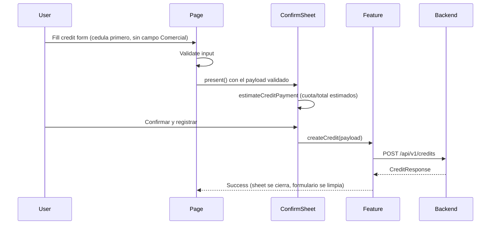

# Flow: Credit Registration

## Estado
- `active`

## Proposito
- Registrar un credito completo y dejar que el backend encole el correo.

## Participantes
- `pages/credit-create/CreditCreatePage.tsx`
- `pages/credit-create/CreditConfirmSheetContent.tsx`
- `entities/credit/validation.ts`
- `entities/credit/payment.ts`
- `features/credits/api.ts`
- `shared/api/client.ts`
- `shared/ui/BottomSheetModal.tsx`

## Flujo

El paso de confirmacion es igual al de `credit-web` (`CreditConfirmDialog.jsx`): el Comercial se muestra ahi (trazabilidad), no en el formulario, porque ya viene de la sesion. Si `createCredit` falla, el sheet se cierra y el error se muestra en el `Banner` de la pagina.

## Errores
- Validacion local: mostrar mensajes antes de llamar API.
- Error backend/red: mostrar banner de error.
- Sesion expirada: interceptor limpia sesion.

## Validacion
- `npm run typecheck`
- `npm run lint`
- `npm test`
- Prueba manual: crear credito y confirmar mensaje de exito.
