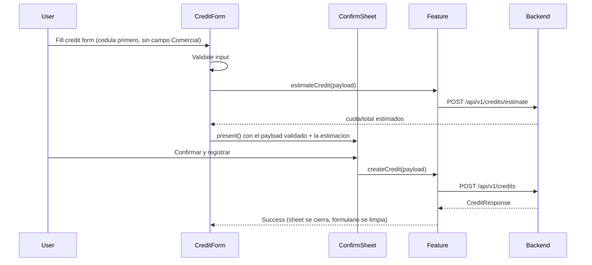

# Flow: Credit Registration

## Estado
- `active`

## Proposito
- Registrar un credito completo y dejar que el backend encole el correo.

## Participantes
- `pages/credit-create/CreditCreatePage.tsx` (wrapper delgado sobre `CreditForm` en modo `create`)
- `pages/credit-create/CreditForm.tsx` (formulario + orquestacion del sheet, compartido con `credit-edit`)
- `pages/credit-create/CreditConfirmSheetContent.tsx`
- `entities/credit/validation.ts`
- `features/credits/api.ts`
- `shared/api/client.ts`
- `shared/ui/BottomSheetModal.tsx`

## Flujo

El paso de confirmacion es igual al de `credit-web` (`CreditConfirmDialog.jsx`): el Comercial se muestra ahi (trazabilidad), no en el formulario, porque ya viene de la sesion. La cuota/total estimados los calcula el backend (`POST /credits/estimate`, misma formula que `CreditResponse.estimatedMonthlyPayment`/`estimatedTotalToPay` y el PDF) — no hay amortizacion calculada en el cliente, ni aqui ni en `credit-web`. Si `estimateCredit` falla se muestra un banner y no se abre el sheet; si `createCredit` falla, el sheet se cierra y el error se muestra en el `Banner` de la pagina.

## Errores
- Validacion local: mostrar mensajes antes de llamar API.
- Fallo al estimar: banner de error, el sheet no se abre.
- Error backend/red al crear: mostrar banner de error.
- Sesion expirada: interceptor limpia sesion.

## Validacion
- `npm run typecheck`
- `npm run lint`
- `npm test`
- Prueba manual: crear credito y confirmar mensaje de exito.
