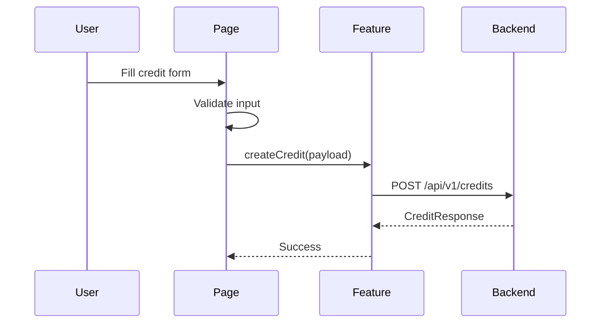

# Flow: Credit Registration

## Estado
- `active`

## Proposito
- Registrar un credito completo y dejar que el backend encole el correo.

## Participantes
- `pages/credit-create/CreditCreatePage.tsx`
- `entities/credit/validation.ts`
- `features/credits/api.ts`
- `shared/api/client.ts`

## Flujo

## Errores
- Validacion local: mostrar mensajes antes de llamar API.
- Error backend/red: mostrar banner de error.
- Sesion expirada: interceptor limpia sesion.

## Validacion
- `npm run typecheck`
- `npm run lint`
- `npm test`
- Prueba manual: crear credito y confirmar mensaje de exito.
