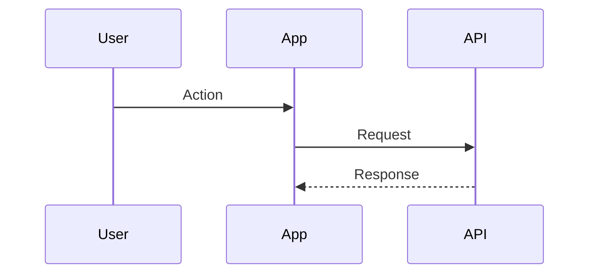

# Flow: <Name>

## Estado
- `active | deprecated | archived`

## Proposito
- <Que resuelve el flujo>

## Participantes
- <Pantalla, feature, entity, shared module>

## Flujo

## Errores
- <Errores esperados y manejo>

## Validacion
- <Comandos o pruebas manuales>

